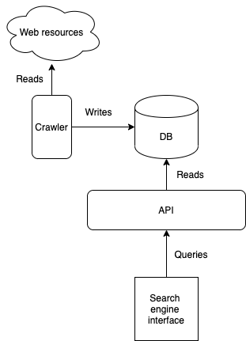

# Simple Web Search Engine

This is a simple implementation of a search engine following the architecture below:

<p align="center">
  
</p>

We have a program called crawler that fetches web pages from the Internet and stores them in the database. The API is an interface to provide a query service which is used by the web interface. And the web interface is where the users search for terms in the webs.

## Run

The whole infrastructure can be run with Docker:

```
docker-compose up
```

With this we have running a container with MongoDB, a container with the code of the crawler, another one running the API and a final one running the server that serves the web interface.

Before doing anything else we need to go to `crawler/config/urls.txt` and put there the list of initial URLs for the crawler in each line.

Now we need to connect to the container with the crawler code and run it:

```
docker-compose exec crawler /bin/bash
cd /container/src
time python main.py
```

Once we have some pages in the database we can go to a browser and access the web interface on `localhost:3000`

<p align="center">
  
</p>

## About the specific implementation

### Crawler

The crawler is implemented in Python using async/await. It has three main classes: the `Crawler` itself whose responsibility is to fetch the URLs and it delegate the responsibility of processing the pages to an instance of `WebpageProcessor`. Also, it keeps fetching the links provided by this instance until a defined maximum depth (and, of course, it skips already visited links).

The `WebpageProcessor` takes the pages and extracts the title and text (discarding script tags, style tags, etc). It also returns all links to internal pages to the `Crawler`, this way we don't have a Crawler that can potentially run forever.

Finally, the `WebpageProcessor` delegates the resposibility of storing the pages to an instance of `WebpageStore`. It stores successful pages in a MongoDB collection and the URLs that gave any error in another collection.

### API

The API is built using Node.js and express. It is very simple, it only has one POST endpoint: `/api/v1.0.0/search` which expects the terms to search in a JSON string, for example:

```
{ "filter": "wikipedia" }
```

And it returns all the pages in the database that contains that term in the URL, title or body.

### Web interface

Made it with React and Bulma CSS, it simply take user terms, sends them to the API and shows the results.